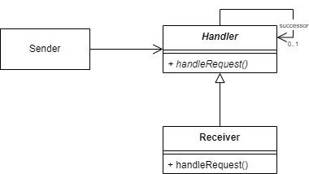

# Chain Of Responsiblity Pattern

The chain of responsibility pattern will created a chain like object structure 
that will handle a incoming signal one-by-one. The chaind of responsibility 
pattern is a **GoF** pattern.

# Class Description

## Handler

The interface provide a method that will delegate the signal to the next successor
in the chain.

## Receiver

Implements the handler interface. The receiver is a concrete implementation of
the wanted algorithm to execute.

## Sender

The sender will send a signal to the handler to start the chain.

# UML

# Sources

Information: https://en.wikipedia.org/wiki/Chain-of-responsibility_pattern
Image: Made by myself 