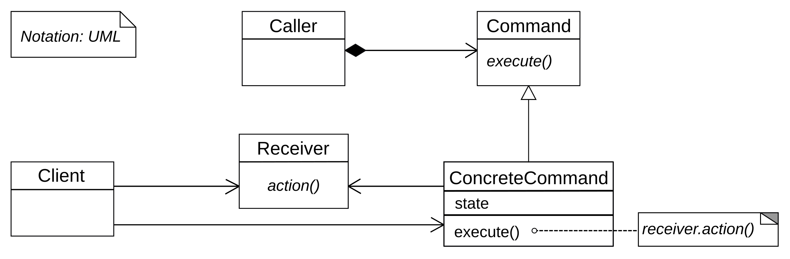

# Command Pattern

The command pattern can be used when you need to configure an object (receiver) 
with a request. The command pattern is a **GoF** pattern.

# Class Description

## Invoker 

The invoker can hold multiple commands. Also the invoker provide different methods
to execute the saved commands.

## Command

A command is something that can be executed and will perform a action in the saved
receiver.

## Receiver 

The receiver is an object that should perform an action when a specific command
was executed. The type of the command define the behavior of the receiver.

# UML

# Sources

Information: https://en.wikipedia.org/wiki/Command_pattern 
Image: https://en.wikipedia.org/wiki/Command_pattern#/media/File:Command_pattern.svg