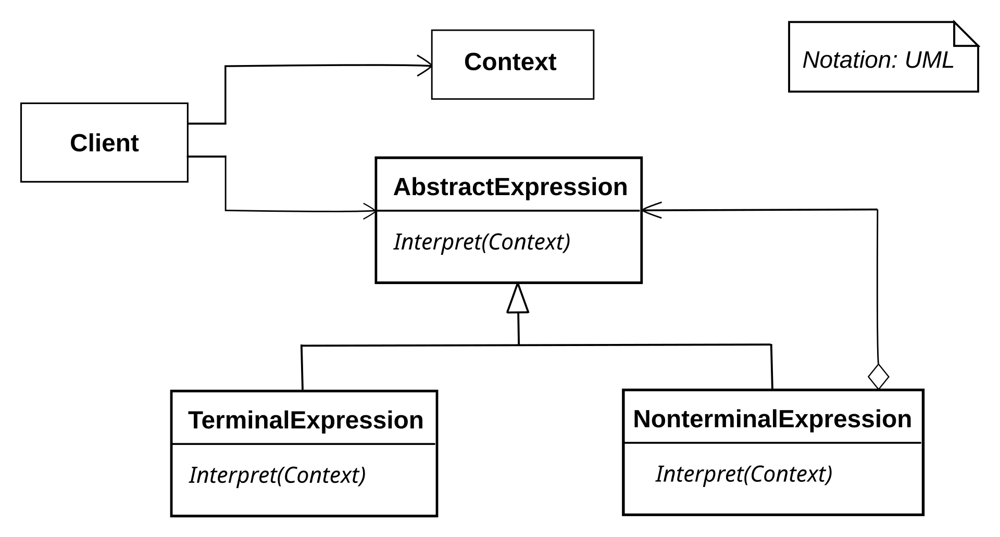

# Interpreter Pattern

The interpreter pattern can be used when you want 
The interpreter pattern is a **GoF** pattern.

# Class Description

# UML

# Sources

Information: https://en.wikipedia.org/wiki/Interpreter_pattern
Image: https://en.wikipedia.org/wiki/Interpreter_pattern#/media/File:Interpreter_UML_class_diagram.svg