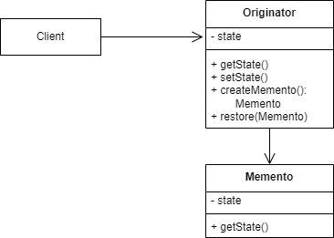

# Memento Pattern

The memento pattern can be used when you want to get the internat state of an 
object and change that state externally but still have the old state in the object
restored. The memento pattern is a **GoF** pattern.

# Class Description

## Originator

The objects of the originator can expose there inner state but can still restore
their state they have before outer changes.

## Mementor

This type will save the inner state of the originator object. With the object of
this type you are able to restore the originators old state.

## (Caretaker)

Between client and originator you can install a third instance: The caretaker.
The caretaker will handle the changes of the originator and will initialize the
restore operation of the originiator. Not implemented in this example.

# UML

# Sources

Information: https://en.wikipedia.org/wiki/Memento_pattern
Image: Made by myself