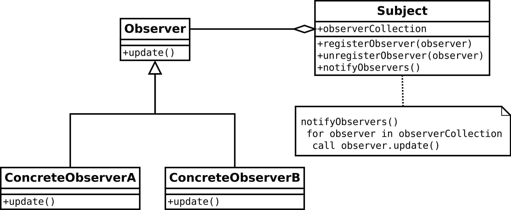

# Observer Pattern

The observer pattern can be used when the same object should have another behabior
when the object is in a specific state. The observer pattern is a **GoF** pattern.

# Class Description

## Observer

The observer type will be notified by an subject when the his inner state changes.

## Subject / Observable

A subject is an object that can be observed by an observer. When the inner
state of this type will change he will notify the oberserver that is oberserving
this object.

# UML

# Sources

Information: https://en.wikipedia.org/wiki/Observer_pattern 
Image: https://en.wikipedia.org/wiki/Observer_pattern#/media/File:Observer_w_update.svg