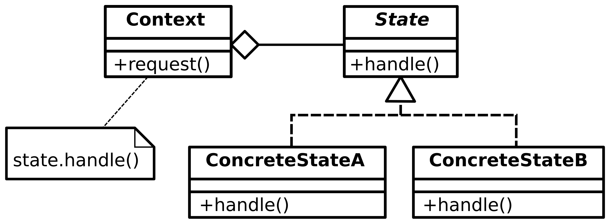

# State Pattern

The state pattern can be used when the same object should have another behabior
when the object is in a specific state. The state pattern is a **GoF** pattern.

# Class Description

## Context 

The context is the type of the object we want to act differently when in an 
specific state.

# UML

# Sources

Information: https://en.wikipedia.org/wiki/State_pattern 
Image: https://en.wikipedia.org/wiki/State_pattern#/media/File:State_Design_Pattern_UML_Class_Diagram.svg 