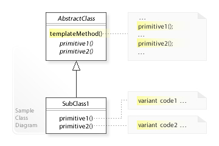

# Template Method Pattern

The template method pattern define a template method that use multiple abstract
methods defined in the same type. The template method pattern is a **GoF** pattern.

# Class Description

## AbstractClass

This type contains a template method that define a algorithm that depend on the
two abstract method in the type defined too.

## Concrete Class

This type extend the abstract class that will define the body of the two abstract
method in the super type.

# UML

# Sources

Information: https://en.wikipedia.org/wiki/Template_method_pattern 
Image: https://en.wikipedia.org/wiki/Template_method_pattern#/media/File:W3sDesign_Template_Method_Design_Pattern_UML.jpg 