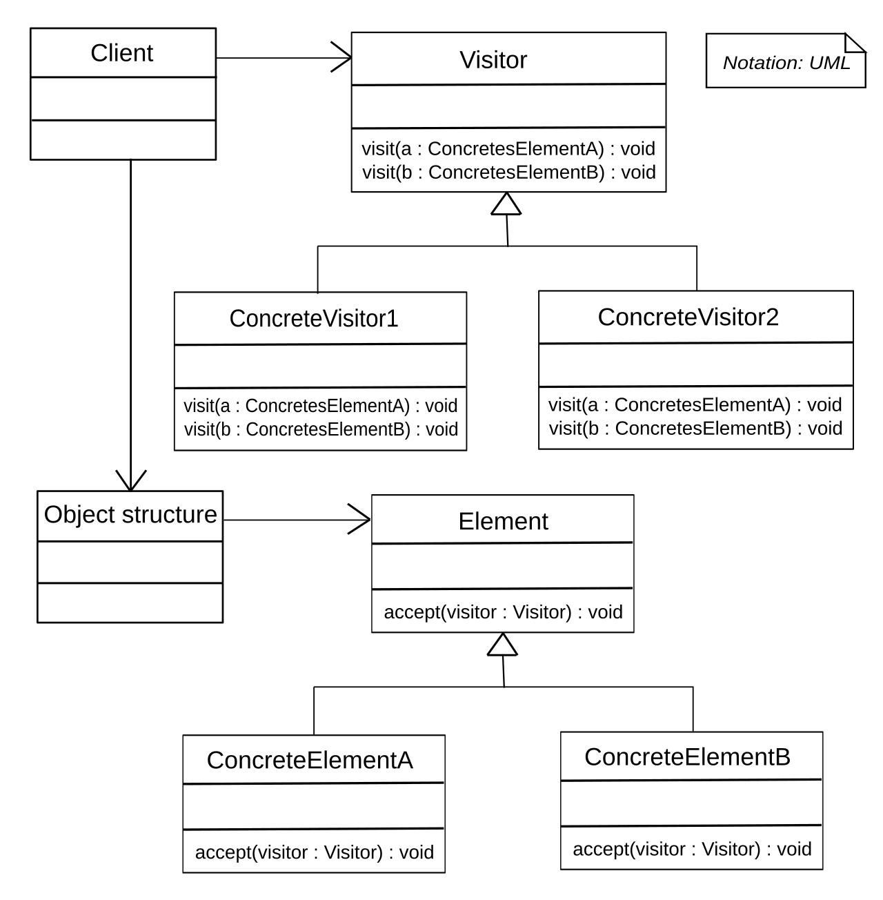

# Visitor Pattern

The visitor pattern can be used when you need to add algorithm to an object without
modifying the class itself. The visitor pattern is a **GoF** pattern.

# Class Description

## Element

The element is the type we want to extend with a new algorithm.

## Visitor

The visitor is taken by a element to extend the element with the algorithm inside
the visitor without changing the class of the element itself.

# UML

# Sources

Information: https://en.wikipedia.org/wiki/Visitor_pattern 
Image: https://en.wikipedia.org/wiki/Visitor_pattern#/media/File:Visitor_design_pattern.svg 