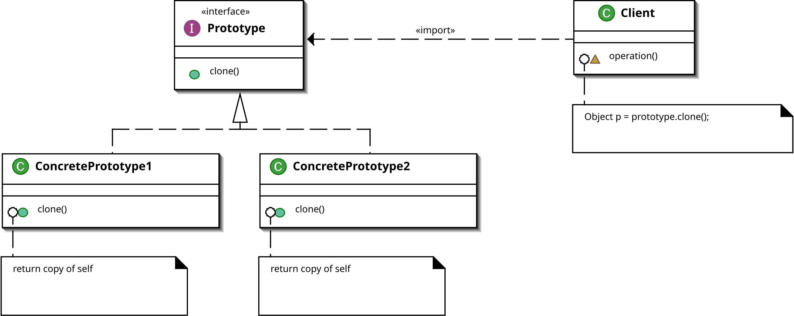

# Prototype Pattern

The Prototype pattern can be used when you want to create a clone of an existing
object without using their class. The prototype pattern is a **GoF** pattern.

# Class Description

## Prototype

A prototype is a type that can clone itself.

# UML

# Sources

Information: https://en.wikipedia.org/wiki/Prototype_pattern 
Image: https://en.wikipedia.org/wiki/Prototype_pattern#/media/File:Prototype_UML.svg