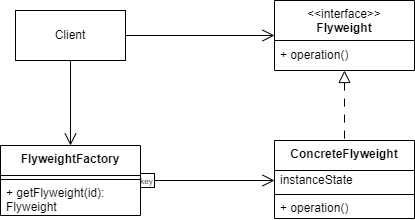

# Flyweight Pattern

The flyweight pattern can be used when you want to minimize memory for saved 
object by sharing information to similar object. The flyweight pattern is a 
**GoF** pattern. 

# Class Description

## Flyweight

The flyweight is an used type in your programm but you want to minimize the
memory usage of instances of this type.

## Flyweigt Factory

Often you use the factory pattern to access flyweight objects. 

# UML

# Sources

Information: https://en.wikipedia.org/wiki/Flyweight_pattern 
Image: Made by myself 