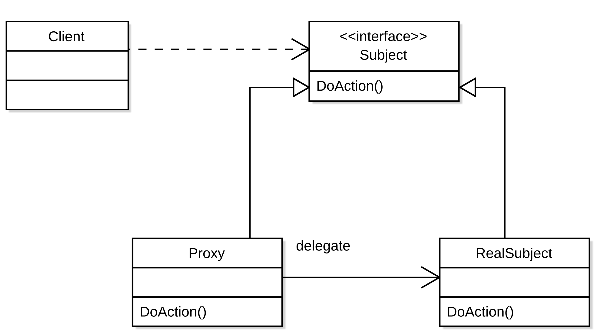

# Proxy Pattern

The proxy pattern can be used when you want to add behavior in term of 
**access**. The proxy pattern is a **GoF** pattern. 

# Class Description

## Proxy

The proxy controlls the access to the real subject. The proxy will create the
real subject on his own.

## RealSubject

The type that should have controlled access with the help of the proxy.

# UML

# Sources

Information: https://en.wikipedia.org/wiki/Proxy_pattern 
Image: https://en.wikipedia.org/wiki/Proxy_pattern#/media/File:Proxy_pattern_diagram.svg