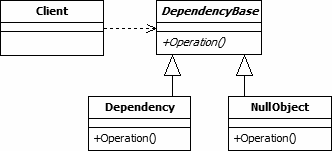

# Null Object Pattern

The null object pattern can be used when you want to avoid if-null-checks in
your programm.

# Class Description

## Strategy

The strategy class is an interface that provide a execute method that will execute
the saved algorithm in it.

# UML

# Sources

Information / Image: https://pharokeepers.github.io/pharo/2019/07/28/Null-Object-Pattern.html