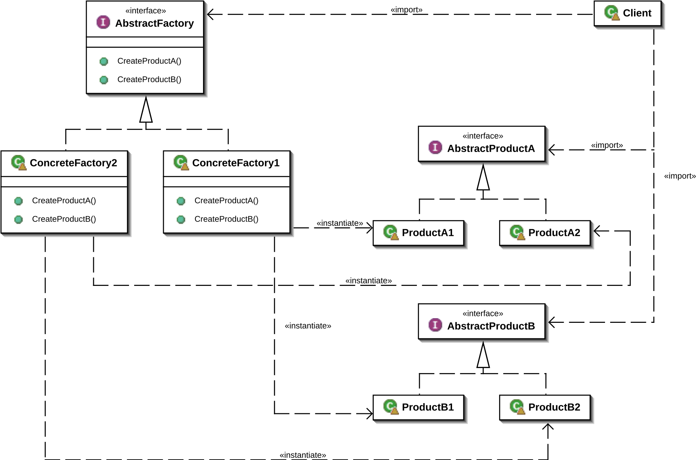

The concrete implementations of the abstract factory and products are in the same
class file!

# Abstract Factory Pattern

The abstract factory pattern can be used when you need to create objects but want
to define the class that is instantiate in a subclass. The abstract factory pattern 
is a **GoF** pattern.

# Class Description

## Abstract Factory 

The abstract factory is an interface that define multiple methods that will all
return different objects that are somehow connected together. A subclass of this
type will define what subtypes of the created object will be created exactly.

## Product

The product class define a type that can be created by the abstract factory.

# UML

# Sources

Information: https://en.wikipedia.org/wiki/Abstract_factory_pattern
Image: https://en.wikipedia.org/wiki/Abstract_factory_pattern#/media/File:Abstract_factory_UML.svg 