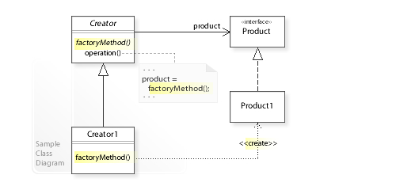

# Factory Method Pattern

The factory method pattern can be used when you need to create objects but want
to define the class that is instantiate in a subclass. The factory method pattern 
is a **GoF** pattern.

# Class Description

## Creator 

The creator class is an interface that provide a method to create a product object.
The concrete create will define the concrete product to create.

## Product

The product class define a type that can be created by the creator.

# UML

# Sources

Information: https://en.wikipedia.org/wiki/Factory_method_pattern
Image: https://en.wikipedia.org/wiki/Factory_method_pattern#/media/File:W3sDesign_Factory_Method_Design_Pattern_UML.jpg