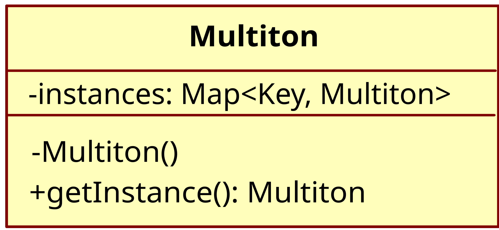

# Multiton pattern

The multiton pattern can be used when you need multiple instances of an class
that should be accessed with an unique key.
The multiton pattern is a **GoF** pattern.

# Class description

## Multiton 

The multiton class provide a static method that take an key as parameter to get
the instance that is assoziated with that key.

# UML

# Sources

Information: https://en.wikipedia.org/wiki/Multiton_pattern
Image: https://en.wikipedia.org/wiki/Multiton_pattern#/media/File:Multiton.svg