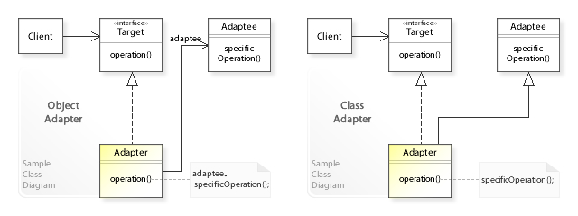

# Adapter Pattern

The adapter pattern allow you to use an existing class as another interface. The
adapter pattern can be implemented as an object adapter or class adapter. The 
adapter pattern is a **GoF** pattern. The adapter pattern is also known as wrapper.

# Class Description

## Target

The target is the class the client want to use but isn't compatible with the target
type.

## Adapter

The adapter take the "real" type the client want use and delegate the method call
to the adpatee.

## Adaptee

The adaptee the "real" type the client want to use.

# UML

# Sources

Information: https://en.wikipedia.org/wiki/Adapter_pattern 
Image: https://en.wikipedia.org/wiki/Adapter_pattern#/media/File:W3sDesign_Adapter_Design_Pattern_UML.jpg 